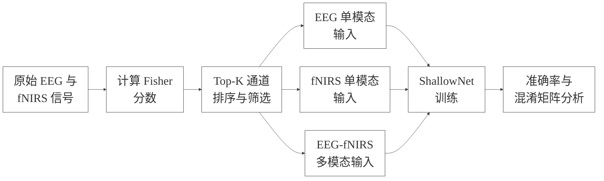
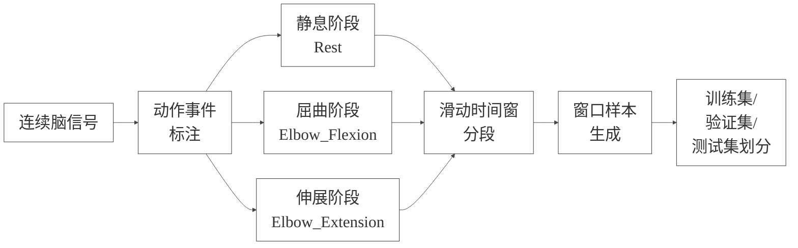
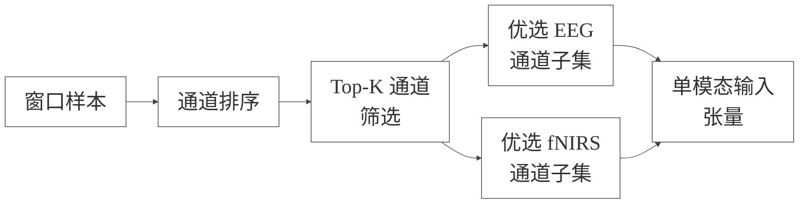
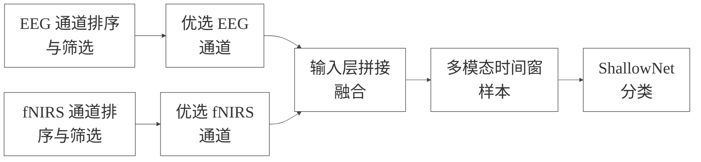
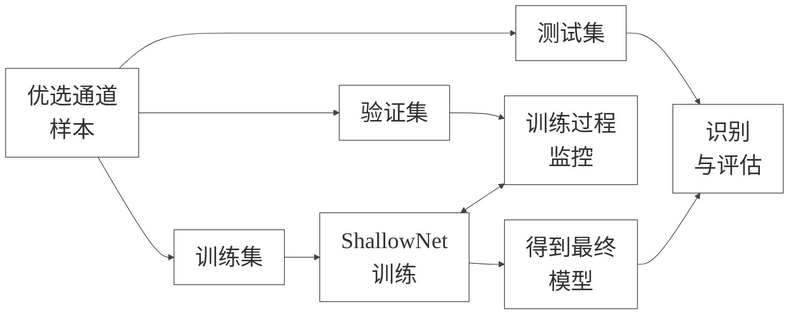
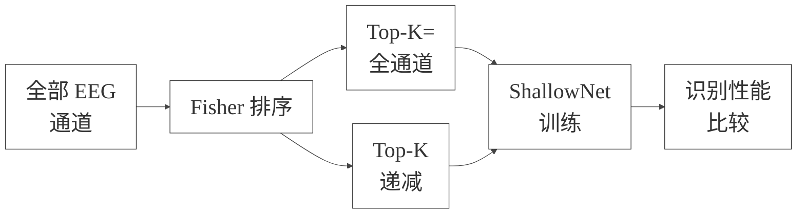
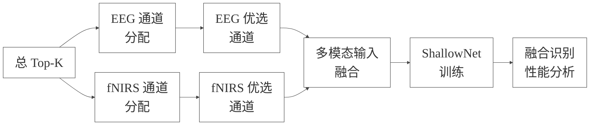

# 第四章 基于通道选择与 ShallowNet 的 EEG-fNIRS 动作识别研究

第三章围绕 EEG 与 fNIRS 脑信号的通道评价与排序方法展开研究，建立了基于 Fisher 分数的通道选择框架，并分别从 EEG 的节律特征与 fNIRS 的血氧动力学特征出发，对不同通道的判别能力进行了量化分析。在此基础上，本章进一步面向动作识别任务开展研究，重点讨论在优选通道条件下，如何构建浅层神经网络模型实现 EEG、fNIRS 及 EEG-fNIRS 融合信号的动作状态识别，并考察不同通道保留规模对识别性能的影响。

与前一章主要解决“哪些通道更有判别价值”这一问题不同，本章更加关注“在给定通道子集条件下，模型能否充分挖掘脑信号中的动作相关信息，以及通道数量变化对识别效果有何影响”。换言之，本章的研究对象已经从通道评价方法本身，转向了通道选择结果在实际分类任务中的应用效果。因此，本章既是对第三章通道选择方法有效性的验证，也是对后续多模态脑信号识别模型构建的重要铺垫。本章的整体研究思路如图4-1所示。

图4-1 本章研究技术路线图

结合本研究的整体技术路线，本章主要包括四个方面的内容。首先，构建基于 ShallowNet 的动作识别模型，分析其适用于脑信号分类任务的结构特点；其次，分别说明 EEG 单模态、fNIRS 单模态以及 EEG-fNIRS 多模态条件下的输入构建方式；再次，围绕不同 Top-K 通道保留规模设计单模态与多模态识别实验；最后，通过实验结果比较不同 Top-K 条件下模型性能的变化趋势，为后续分析通道选择策略的实用价值提供实验支撑。

需要说明的是，本章采用 ShallowNet 作为统一的识别模型，并非单纯出于实现便利性的考虑，而是因为浅层卷积神经网络在脑信号解码领域具有较好的代表性。一方面，该类模型结构相对简洁，能够降低由过深网络带来的参数复杂度和训练不稳定问题；另一方面，其卷积结构对时空模式具有一定的捕获能力，能够在保留较强可解释性的同时完成有效分类。因此，将 ShallowNet 作为本章的核心模型，有助于更清晰地观察优选通道数量变化对识别性能的影响，而不至于被过于复杂的模型结构掩盖实验规律。

## 4.1 实验数据与评价流程说明

本章实验继续采用前文构建的肘关节运动数据。该数据以 EEG 与 fNIRS 两种模态为基础，并围绕动作发生过程构建了统一的三分类标签体系，即静息状态、肘关节屈曲状态和肘关节伸展状态。由于两种模态在进入分类模型之前已经被统一映射到相同的行为语义空间，因此本章可以在相同任务定义下，分别开展单模态识别实验和多模态融合识别实验。

在样本构建方面，本研究采用滑动时间窗的方式对连续脑信号进行分段。每个时间窗对应一个局部时序样本，其标签由所在动作阶段确定。该策略既能够充分利用连续信号中的时序信息，又能够在有限试次数量条件下有效增加样本规模，从而为后续监督学习模型训练提供更充足的数据支持。对于脑信号识别问题而言，基于窗口的构样方式具有较好的工程可行性和建模稳定性，因此已成为本研究实验设计中的基本处理方式。EEG 与 fNIRS 的样本构建流程如图4-2所示。

图4-2 EEG 与 fNIRS 样本构建方法

在数据集划分方面，本章采用训练集、验证集和测试集相互独立的实验流程。训练集用于模型参数学习，验证集用于训练过程中的参数调节与状态监控，测试集则用于在模型训练完成后评估最终识别性能。为了保证不同类别样本在各子集中的分布尽可能一致，实验过程中采用分层划分思想，以减少类别比例失衡对评价结果造成的偏差。通过这种处理方式，可以较为客观地比较不同 Top-K 条件下模型的识别能力差异。

在评价指标方面，本章以测试集准确率作为主要性能指标，并辅以混淆矩阵对分类结果进行分析。测试集准确率能够直观反映模型对三类动作状态的整体识别水平，而混淆矩阵则有助于观察不同类别之间的易混淆关系。由于本章的研究重点是不同通道保留规模对识别性能的影响，因此后续实验结果部分将主要围绕“测试准确率随 Top-K 变化的趋势”展开讨论，并在必要时结合类别混淆现象分析潜在原因。

此外，需要指出的是，本章实验在模型训练控制策略上尽量保持统一，以减少与通道数量无关因素对结果解释的干扰。尤其在 ShallowNet 实验中，训练过程采用固定轮数策略，不引入额外的提前停止机制。这种处理方式能够使不同 Top-K 条件下的训练过程保持更高的一致性，从而使实验结论更集中地反映通道选择本身对动作识别性能的影响。

## 4.2 基于 ShallowNet 的动作识别模型构建

### 4.2.1 ShallowNet 网络结构

ShallowNet 是一种典型的浅层卷积神经网络，在脑电信号解码研究中具有较高的代表性。与传统基于人工特征设计的方法相比，ShallowNet 能够直接从原始或预处理后的时序信号中学习判别性表示，从而减少手工特征工程对模型性能的限制。与更深层的神经网络相比，ShallowNet 结构相对简单，参数规模较小，训练过程更加稳定，因而特别适合中小规模脑信号数据上的分类任务。

从建模思想上看，ShallowNet 兼顾了脑信号解码中的时域特征提取与空间模式学习。浅层卷积结构首先在时间维上提取局部动态模式，再结合跨通道的信息聚合实现对多通道脑信号空间分布特征的建模。这种结构与传统脑信号分析中“时域-空域联合建模”的思想具有较强一致性，因此能够较好适用于运动相关脑信号识别问题。其基本结构可概括如图4-3所示。

图4-3 ShallowNet 网络结构

在本研究中，ShallowNet 的输入形式统一为多通道时间序列样本，每个样本由若干个已选通道及其对应的时间窗信号组成。对于不同实验条件，模型的类别数保持一致，而输入通道数则会随着 Top-K 设置发生变化。因此，在每一轮实验中，模型都需要根据当前保留的通道规模进行重新构建，以确保网络结构与输入数据维度严格匹配。这种动态适配机制使得 ShallowNet 能够在不同通道规模下稳定运行，并为后续 Top-K 实验比较提供统一建模基础。

选用 ShallowNet 作为本章核心模型还有一个重要原因，即其能够较为直接地体现通道选择的作用。当网络结构较浅时，模型性能更容易受到输入信号质量和输入通道组成的影响，因此通道选择结果对识别精度的贡献会更加清晰地表现出来。换言之，ShallowNet 为观察“优选通道是否优于全通道输入”以及“不同通道数配置对识别性能的影响”提供了较好的实验载体。

### 4.2.2 单模态输入构建方法

在 EEG 单模态识别任务中，输入数据由优选 EEG 通道对应的窗口样本构成。首先，根据第三章建立的通道评价方法，对所有 EEG 通道进行判别能力排序；然后，在给定的 Top-K 条件下保留评分最高的若干通道；最后，从原始窗口样本中提取这些通道对应的时间序列，形成新的单模态 EEG 输入数据。经过这一处理后，模型接收到的不再是全部 EEG 通道，而是经过判别能力筛选后的优选通道子集。

这种输入构建方式具有两方面意义。其一，通过减少低判别力通道的干扰，可以使模型更加集中地学习与动作状态相关的脑电模式，从而提高特征利用效率；其二，通过控制保留通道数量，可以系统考察不同通道规模下的分类效果变化规律，为确定较优 EEG 通道数量提供实验依据。单模态条件下的输入构建方式如图4-4所示。

图4-4 单模态输入组织方式

在 fNIRS 单模态识别任务中，输入构建过程与 EEG 基本一致，但其通道选择基本单位并非单个测量通道，而是同一位置上的 HbO/HbR 通道对。具体而言，本研究首先对各位置对的判别能力进行评价，再根据 Top-K 条件保留若干位置对，并将其展开为对应的 fNIRS 通道集合。随后，从窗口样本中提取这些通道对应的血氧时间序列，构成 fNIRS 单模态输入数据。由于 fNIRS 信号同样属于多通道时间序列，因此其进入 ShallowNet 时的输入组织形式与 EEG 保持一致。

总体来看，本研究的单模态输入构建具有统一的处理逻辑，即先基于通道评价结果完成筛选，再在窗口样本层面重构模型输入。这种设计使单模态识别实验能够直接反映第三章通道选择方法的实际应用效果，同时也为后续比较 EEG 与 fNIRS 两种模态在不同 Top-K 条件下的识别表现奠定了基础。

### 4.2.3 多模态输入构建方法

与单模态任务相比，多模态动作识别不仅需要考虑每种模态内部的通道优选问题，还需要解决不同模态之间的输入组织方式问题。在本研究中，EEG-fNIRS 多模态输入的构建遵循“先模态内筛选、后模态间融合”的基本思路。具体而言，首先分别对 EEG 和 fNIRS 两种模态内部的通道进行排序与筛选；然后，将两部分优选通道在时间维对齐的前提下进行组合，形成统一的多模态输入数据。

在 ShallowNet 框架下，本章采用输入层早期融合策略来构建多模态样本，即将 EEG 优选通道与 fNIRS 优选通道直接拼接为一个完整的多通道时间序列，再输入同一个浅层卷积网络进行分类。这种方法的优点在于结构简洁、实现清晰，能够在保持模型统一性的前提下，同时利用 EEG 的神经电活动信息与 fNIRS 的血氧动力学信息，从而增强模型对动作状态的综合判别能力。多模态输入构建过程如图4-5所示。

图4-5 EEG-fNIRS 多模态输入融合方式

从实验设计角度看，多模态输入构建不仅涉及总通道数的设定，还涉及不同模态通道占比的分配问题。由于 EEG 与 fNIRS 在原始通道规模、生理信息类型以及时序特性上均存在差异，不同模态通道比例可能会对融合识别结果产生影响。因此，在多模态 Top-K 实验中，除考察总通道数变化外，还需关注 EEG 与 fNIRS 通道配比变化对模型性能的潜在影响。这一设计使多模态实验能够更全面地反映通道选择策略在融合场景下的实际价值。

从方法论角度看，多模态输入构建的核心并不在于简单拼接两类信号，而在于在融合之前先分别完成模态内优选。这样可以尽可能保留每种模态中最具判别力的信息，同时减少无效通道和冗余通道对融合识别的不利影响。因而，本研究所采用的多模态输入构建方式，本质上是一种建立在通道选择基础上的早期融合方法。

### 4.2.4 模型训练参数设置

为保证不同实验条件之间的可比性，本章在模型训练参数设置上保持统一。首先，在样本构建层面，各实验均采用相同的时间窗长度与时间窗步长，以确保不同模态和不同 Top-K 条件下输入样本的时间尺度一致。其次，在模型训练层面，各实验均采用统一的批大小、学习率和最大训练轮数设置，使不同实验结果之间具有可比的训练基础。

在优化方法上，本研究采用 AdamW 优化器对模型参数进行更新。相较于传统随机梯度下降方法，AdamW 结合了自适应学习率与权重衰减机制，能够在脑信号分类等中小规模数据场景下取得较为稳定的训练效果。为进一步提高训练稳定性，本研究同时引入学习率衰减策略，使模型在训练初期保持较高学习能力，而在训练后期逐渐减小参数更新步长，从而有助于收敛到更稳定的解。

在损失函数设计方面，本章采用带类别权重的交叉熵损失函数，以减轻类别样本数不均衡可能带来的训练偏置问题。由于不同动作状态在滑窗构样后所形成的样本数量可能存在差异，若直接采用普通交叉熵损失，模型可能更倾向于预测样本数量较多的类别。通过引入类别权重，可以在一定程度上平衡不同类别对模型参数更新的影响，提高分类结果的公平性与稳定性。

此外，本章在 ShallowNet 实验中采用固定轮数训练策略，而不引入早停机制。这样做的主要原因在于：本章研究重点是比较不同通道规模下的模型性能差异，若在不同 Top-K 条件下引入早停，则训练轮数会随验证集波动而变化，进而增加结果解释的复杂性。采用固定训练轮数能够使各组实验在训练控制条件上保持一致，从而使最终结果更集中地反映优选通道数量变化对识别性能的影响。整体训练与评估流程如图4-6所示。

图4-6 模型训练与评估方案

## 4.3 基于 Top-K 通道选择的动作识别实验设计

### 4.3.1 EEG 单模态 Top-K 识别实验

EEG 单模态 Top-K 识别实验的核心目的是分析在不同 EEG 通道保留规模下，ShallowNet 对动作状态的识别能力变化情况。为此，本研究首先对全部 EEG 通道进行判别能力排序，再按照预设的 Top-K 策略逐步减少保留通道数量，并在每一个通道规模条件下重新完成样本构建、模型训练与测试评价。通过这一过程，可以系统获得“通道数量 - 识别精度”之间的关系曲线。

该实验设计具有两方面意义。一方面，它可以直接验证第三章提出的 EEG 通道选择方法是否能够在分类任务中发挥积极作用，即优选通道输入是否优于盲目使用全部通道；另一方面，它能够进一步揭示 EEG 输入维度与识别性能之间的关系，分析是否存在一个能够兼顾识别精度与通道规模的较优 Top-K 取值。

从实验逻辑上看，若在某些 Top-K 条件下模型性能接近甚至超过全通道输入结果，则说明 EEG 动作识别任务中存在明显的冗余通道，适当通道筛选不仅不会削弱模型性能，反而可能通过去除噪声通道和低判别力通道提升模型稳定性。因此，EEG 单模态 Top-K 实验不仅是分类实验，也是一种对通道选择方法有效性的功能性验证。该实验设计过程如图4-7所示。

图4-7 EEG 单模态 Top-K 实验设计示意图

### 4.3.2 fNIRS 单模态 Top-K 识别实验

fNIRS 单模态 Top-K 识别实验的目的在于分析优选血氧通道子集对动作识别性能的影响。考虑到 fNIRS 通道在本研究中按 HbO/HbR 位置对进行评价与筛选，因此该实验实际上考察的是“不同数量的优选位置对”对识别性能的作用。随着 Top-K 的变化，输入模型的 fNIRS 通道规模会发生相应变化，从而能够系统观察通道规模压缩对分类性能的影响。

与 EEG 相比，fNIRS 信号具有更明显的血氧动力学特征和更缓慢的时序变化，因此其最优通道配置未必与 EEG 呈现相同规律。通过开展 fNIRS 单模态 Top-K 实验，可以从实验结果层面回答以下问题：在保持动作识别精度的前提下，是否能够显著减少 fNIRS 输入通道数量；通道对级别的筛选是否有助于提高 ShallowNet 对血氧信号的判别能力；以及 fNIRS 通道数变化与分类性能之间是否存在明显的阈值效应。

该实验对于评估 fNIRS 通道选择方法的实用价值具有重要意义。若在较少通道条件下依然能够维持较好的识别精度，则说明通道选择不仅有助于提高模型效率，也可能为后续简化硬件布置和降低系统复杂度提供参考依据。fNIRS 单模态 Top-K 实验流程如图4-8所示。

图4-8 fNIRS 单模态 Top-K 实验设计示意图

### 4.3.3 EEG-fNIRS 多模态 Top-K 识别实验

EEG-fNIRS 多模态 Top-K 识别实验是在单模态实验基础上的进一步拓展，其核心目标是分析在优选通道融合条件下，ShallowNet 是否能够充分利用两种模态的互补信息，从而获得优于单模态的动作识别效果。为此，本研究首先分别在 EEG 和 fNIRS 模态内部完成通道排序与筛选，然后在给定总通道数或指定模态通道配比条件下，构建融合输入并开展分类实验。

与单模态实验相比，多模态 Top-K 实验具有更复杂的设计维度。除了需要关注总保留通道数量外，还需要考虑 EEG 通道数与 fNIRS 通道数之间的比例关系。不同模态在动作识别中所起的作用并不完全相同：EEG 更敏感于快速神经电活动变化，而 fNIRS 更能够反映与动作相关的血氧动力学响应。因此，在总通道数一定的前提下，不同模态配比可能会导致融合模型性能出现明显差异。

该实验的理论意义在于，从优选通道融合的角度验证 EEG 与 fNIRS 的互补性。如果多模态优选通道输入能够稳定优于任一单模态输入，则说明 EEG 与 fNIRS 在动作识别任务中确实提供了相互补充的信息；反之，若融合效果并未明显提升，则需要进一步分析其原因，可能涉及通道分配、融合方式或样本规模等多方面因素。因此，多模态 Top-K 实验是本章最关键的实验设计之一，也是后续结果讨论的重点。其总体实验设计如图4-9所示。

图4-9 EEG-fNIRS 多模态 Top-K 实验设计示意图

## 4.4 实验结果与分析

### 4.4.1 EEG 不同 Top-K 下的识别结果分析

[图4-10 EEG不同Top-K条件下测试准确率变化曲线图]

### 4.4.2 fNIRS 不同 Top-K 下的识别结果分析

[图4-11 fNIRS不同Top-K条件下测试准确率变化曲线图]

### 4.4.3 EEG-fNIRS 不同 Top-K 下的识别结果分析

[图4-12 EEG-fNIRS不同Top-K条件下测试准确率变化曲线图]

## 4.5 本章小结

本章在第三章通道选择研究的基础上，进一步开展了基于 ShallowNet 的 EEG-fNIRS 动作识别研究。首先，围绕浅层卷积神经网络的结构特点，构建了适用于本研究任务的统一识别模型；其次，分别从 EEG 单模态、fNIRS 单模态以及 EEG-fNIRS 多模态三个层面，阐述了优选通道条件下的输入构建方式；随后，结合统一的训练参数设置，设计了面向不同 Top-K 通道规模的动作识别实验，用于考察通道数量变化对分类性能的影响。

总体而言，本章的研究重点在于将前文提出的通道选择方法进一步落实到实际分类任务中，并通过统一模型框架比较不同模态、不同通道规模条件下的识别效果。该研究不仅能够从实验层面验证通道选择策略的有效性，也为后续分析多模态脑信号融合识别的优势提供了直接依据。下一步，可在实验结果基础上进一步讨论不同模态在动作识别中的贡献差异，以及优选通道条件下模型性能提升的内在原因。
